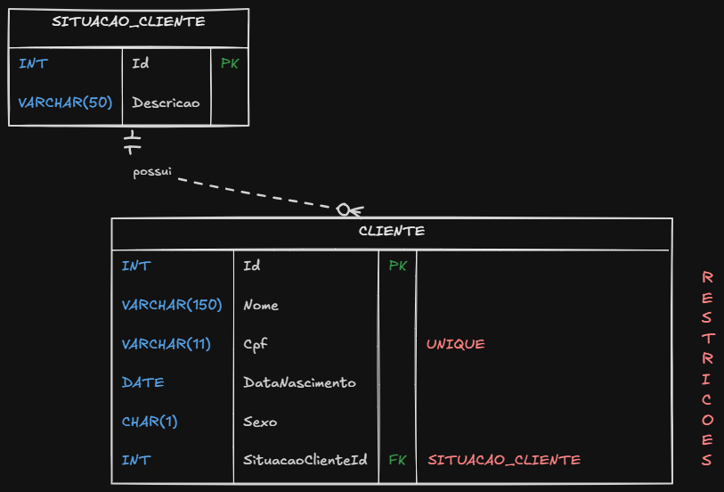

# Teste técnico - Fácil Assist

Este projeto foi desenvolvido para o teste técnico da Fácil Assist. A ideia era montar um sistema web simples para gestão de clientes, seguindo a arquitetura pedida no documento do teste:

```text
Aplicação Web -> API -> Banco de Dados
```

Procurei manter o projeto simples, mas com uma separação clara entre as responsabilidades. A tela web não acessa o banco diretamente. Ela conversa com a API, e a API é quem concentra as regras de negócio e o acesso ao SQL Server.

## Tecnologias utilizadas

- ASP.NET Core Web API
- ASP.NET Core Razor Pages
- SQL Server
- Stored Procedures
- Dapper
- Swagger
- Bootstrap

Escolhi Web API porque é uma forma simples e atual de expor os endpoints do sistema. Para o front, usei Razor Pages porque ele fica dentro do ecossistema ASP.NET e atende bem a proposta de uma tela simples, sem precisar trazer um framework maior como React ou Angular para um CRUD pequeno.

Usei Dapper na API para chamar as procedures do SQL Server. Ele é mais direto que um ORM completo e combina bem com o requisito do teste, já que todos os acessos ao banco precisam passar por procedures.

## Estrutura do projeto

```text
Database/
  01_Tabelas_e_Procedures.sql

docs/
  teste-remoto-facil-assist.pdf

FacilAssist/
  FacilAssist.API/
  FacilAssist.Web/
  FacilAssist.slnx
```

Na API, separei o código em algumas pastas principais:

```text
Controllers/
DTOs/
Middlewares/
Models/
Repositories/
Services/
```

Os controllers recebem as requisições HTTP e devolvem as respostas. Os services concentram as validações e regras de negócio. Os repositories fazem a comunicação com o banco, sempre chamando stored procedures.

Também criei DTOs para separar o que entra e sai da API dos models internos. Essa decisão ajudou principalmente porque alguns campos, como a descrição da situação do cliente, fazem sentido na listagem, mas não devem ser enviados no cadastro.

## Banco de dados

O banco usado foi o `FacilAssistDB`, no SQL Server.

O script principal está em:

```text
Database/01_Tabelas_e_Procedures.sql
```

Ele cria as tabelas:

- `Cliente`
- `SituacaoCliente`

A tabela `Cliente` possui os campos pedidos no teste:

- Nome
- CPF
- Data de nascimento
- Sexo
- Situação do cliente

O CPF foi definido como único no banco. Mesmo existindo validações na API, deixei essa regra no banco porque é ele que garante a integridade final dos dados.

As procedures criadas foram:

- `sp_InserirCliente`
- `sp_AtualizarCliente`
- `sp_ExcluirCliente`
- `sp_ListarClientes`

## API

A API possui endpoints para o CRUD de clientes:

```text
GET    /api/clientes
POST   /api/clientes
PUT    /api/clientes/{id}
DELETE /api/clientes/{id}
```

Também configurei o Swagger para facilitar os testes:

```text
http://localhost:5206/swagger
```

### Validações e tratamento de erros

Implementei validações básicas no service, como:

- nome obrigatório
- CPF obrigatório
- CPF válido
- data de nascimento não pode estar no futuro
- id inválido em alteração e exclusão

Também criei um middleware global de exceções. Ele evita repetir `try/catch` em todos os endpoints e padroniza as respostas de erro.

Alguns erros do SQL Server também foram tratados, por exemplo CPF duplicado. Nesse caso, o banco gera erro por causa da constraint única, e a API traduz isso para uma resposta mais clara.

Exemplo:

```text
409 Conflict
Já existe um cliente cadastrado com este CPF.
```

Também adicionei logs na API usando o `ILogger` do ASP.NET. Optei por não logar CPF nem dados sensíveis, apenas operações gerais, ids e erros tratados.

## Aplicação Web

A aplicação web está no projeto:

```text
FacilAssist/FacilAssist.Web
```

Ela foi feita com Razor Pages e consome a API usando `HttpClient`. A URL da API fica configurada em:

```text
FacilAssist/FacilAssist.Web/appsettings.json
```

```json
"ApiSettings": {
  "BaseUrl": "http://localhost:5206"
}
```

A tela permite:

- cadastrar cliente
- listar clientes
- editar cliente
- excluir cliente

## Como rodar o projeto

Primeiro, crie o banco no SQL Server executando o script:

```text
Database/01_Tabelas_e_Procedures.sql
```

Neste ambiente, usei autenticação do Windows para conectar ao SQL Server. A connection string da API ficou assim:

```json
"DefaultConnection": "Server=localhost;Database=FacilAssistDB;Trusted_Connection=True;TrustServerCertificate=True;"
```

Depois, na raiz do repositório, restaure e compile a solução:

```powershell
dotnet restore FacilAssist/FacilAssist.slnx
dotnet build FacilAssist/FacilAssist.slnx
```

Para iniciar a API:

```powershell
dotnet run --project FacilAssist/FacilAssist.API
```

A API deve subir em:

```text
http://localhost:5206
```

Para iniciar a aplicação web, abra outro terminal e rode:

```powershell
dotnet run --project FacilAssist/FacilAssist.Web
```

A aplicação web deve subir em:

```text
http://localhost:5255
```

Ordem recomendada:

```text
1. SQL Server
2. API
3. Web
```

## Dificuldades e decisões durante o desenvolvimento

Uma dificuldade no começo foi a instalação do SQL Server 2022. A instalação falhou com o erro `0x851A001A`, relacionado ao tamanho de setor informado pelo Windows em SSD/NVMe. É um problema conhecido pela Microsoft em alguns cenários. Depois de aplicar o ajuste recomendado, reiniciar a máquina e reinstalar o SQL Server, consegui seguir normalmente.

Durante o desenvolvimento da API, também percebi que usar diretamente o model `Cliente` nas requisições poderia misturar responsabilidades. Um exemplo foi o campo de descrição da situação do cliente, que vem da listagem com `JOIN`, mas não faz sentido ser enviado no cadastro. Por isso criei DTOs para entrada, atualização e saída.

Outra decisão foi manter interfaces para services e repositories. Para um projeto pequeno, poderia funcionar com classes concretas, mas preferi usar interfaces para deixar mais clara a separação entre contrato e implementação, além de facilitar manutenção e testes no futuro.

No front, optei por Razor Pages porque a proposta do teste pedia uma página web simples. Pensei que trazer um front mais pesado criaria mais complexidade do que benefício para esse caso.

## Pontos que eu melhoraria com mais tempo

- Adicionar testes automatizados para as validações de CPF e regras do service.
- Melhorar o retorno quando uma alteração ou exclusão usa um id que não existe.
- Criar filtros de busca na listagem.
- Adicionar paginação caso o volume de clientes cresça.
- Melhorar a interface visual da aplicação web.

## DER


